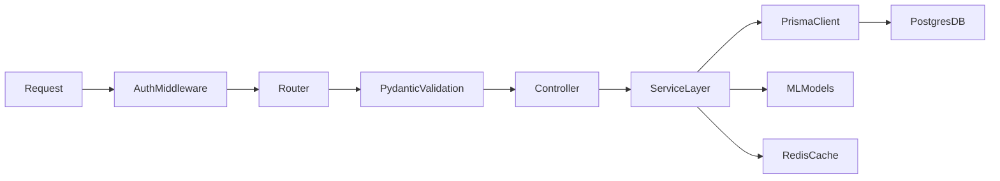

# Backend Architecture

```mermaid
flowchart LR
    Request --> AuthMiddleware
    AuthMiddleware --> Router
    Router --> PydanticValidation
    PydanticValidation --> Controller
    Controller --> ServiceLayer
    ServiceLayer --> PrismaClient
    PrismaClient --> PostgresDB
    ServiceLayer --> MLModels
    ServiceLayer --> RedisCache
```
