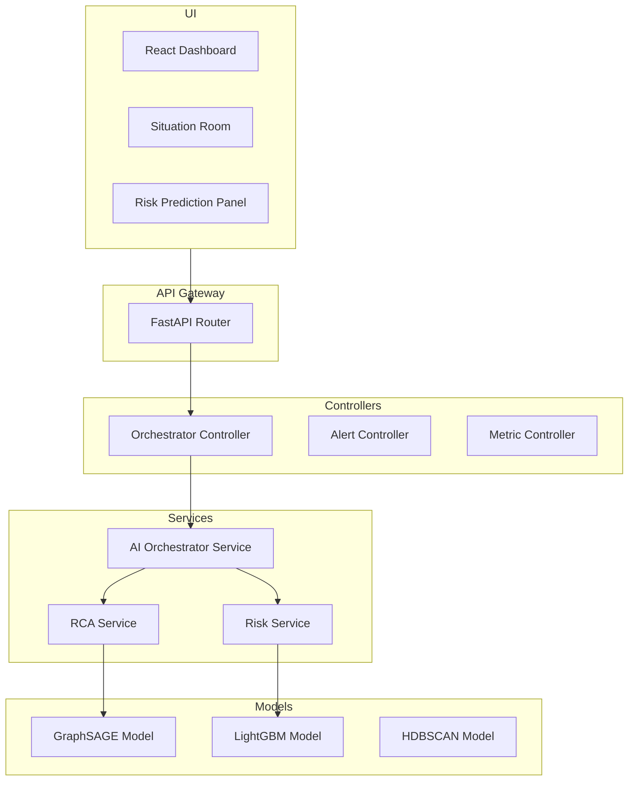

# Component Architecture

```mermaid
flowchart TD
    subgraph UI
        Dashboard[React Dashboard]
        SituationRoom[Situation Room]
        RiskPanel[Risk Prediction Panel]
    end

    subgraph API Gateway
        FastAPI[FastAPI Router]
    end

    subgraph Controllers
        OrchestratorCtrl[Orchestrator Controller]
        AlertCtrl[Alert Controller]
        MetricCtrl[Metric Controller]
    end

    subgraph Services
        OrchSvc[AI Orchestrator Service]
        RcaSvc[RCA Service]
        RiskSvc[Risk Service]
    end

    subgraph Models
        GS[GraphSAGE Model]
        LGB[LightGBM Model]
        HDB[HDBSCAN Model]
    end

    UI --> FastAPI
    FastAPI --> OrchestratorCtrl
    OrchestratorCtrl --> OrchSvc
    OrchSvc --> RcaSvc
    RcaSvc --> GS
    OrchSvc --> RiskSvc
    RiskSvc --> LGB
```
