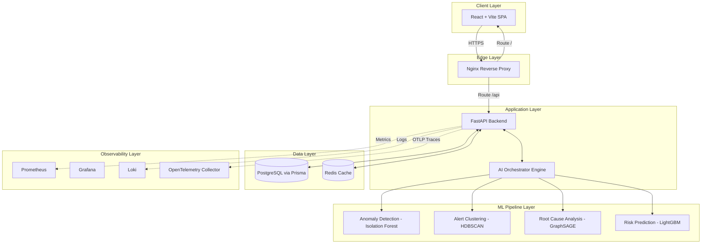

# High-Level Architecture
This diagram outlines the complete AIOps Sentinel platform, depicting how the frontend, backend, ML engines, database, and observability layers interact.

```mermaid
flowchart TD
    subgraph Client Layer
        UI[React + Vite SPA]
    end

    subgraph Edge Layer
        Nginx[Nginx Reverse Proxy]
    end

    subgraph Application Layer
        API[FastAPI Backend]
        Orchestrator[AI Orchestrator Engine]
    end

    subgraph ML Pipeline Layer
        AD[Anomaly Detection - Isolation Forest]
        AC[Alert Clustering - HDBSCAN]
        RCA[Root Cause Analysis - GraphSAGE]
        RP[Risk Prediction - LightGBM]
    end

    subgraph Data Layer
        PG[(PostgreSQL via Prisma)]
        Redis[(Redis Cache)]
    end

    subgraph Observability Layer
        Prometheus[Prometheus]
        Grafana[Grafana]
        Loki[Loki]
        Otel[OpenTelemetry Collector]
    end

    UI -->|HTTPS| Nginx
    Nginx -->|Route /api| API
    Nginx -->|Route /| UI
    
    API <--> Orchestrator
    Orchestrator --> AD
    Orchestrator --> AC
    Orchestrator --> RCA
    Orchestrator --> RP
    
    API <--> PG
    API <--> Redis

    API -.->|OTLP Traces| Otel
    API -.->|Logs| Loki
    API -.->|Metrics| Prometheus
```
