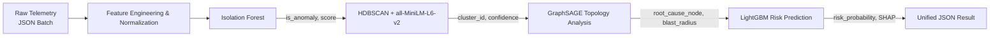

# ML Pipeline Architecture
This details the sequential data flow of the ML Orchestrator.

```mermaid
flowchart LR
    Input[Raw Telemetry
JSON Batch] --> Preprocess[Feature Engineering & Normalization]
    
    Preprocess --> AD[Isolation Forest]
    AD -->|is_anomaly, score| AC[HDBSCAN + all-MiniLM-L6-v2]
    
    AC -->|cluster_id, confidence| RCA[GraphSAGE Topology Analysis]
    RCA -->|root_cause_node, blast_radius| RP[LightGBM Risk Prediction]
    
    RP -->|risk_probability, SHAP| Output[Unified JSON Result]
```
