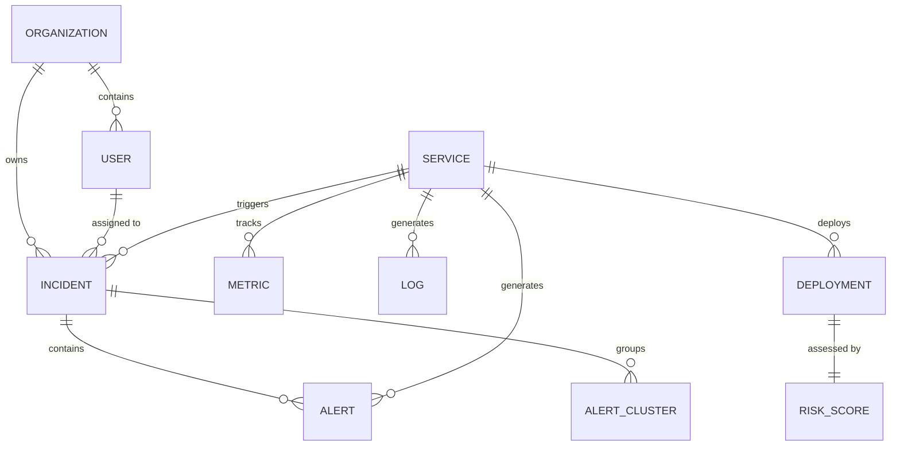

# Database Entity-Relationship Diagram

```mermaid
erDiagram
    ORGANIZATION ||--o{ USER : contains
    ORGANIZATION ||--o{ INCIDENT : owns
    USER ||--o{ INCIDENT : "assigned to"
    SERVICE ||--o{ INCIDENT : triggers
    INCIDENT ||--o{ ALERT : contains
    INCIDENT ||--o{ ALERT_CLUSTER : groups
    SERVICE ||--o{ ALERT : generates
    SERVICE ||--o{ METRIC : tracks
    SERVICE ||--o{ LOG : generates
    SERVICE ||--o{ DEPLOYMENT : deploys
    DEPLOYMENT ||--|| RISK_SCORE : "assessed by"
```
