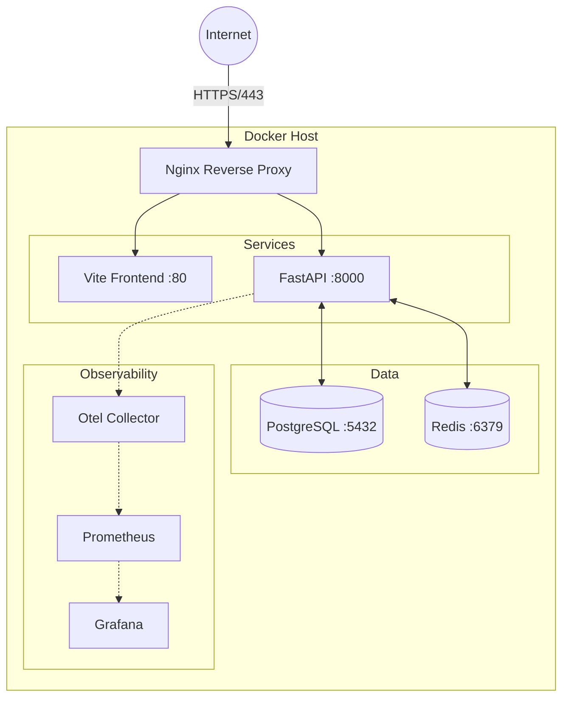

# Deployment Architecture

```mermaid
flowchart TD
    Internet((Internet))
    
    subgraph Docker Host
        Nginx[Nginx Reverse Proxy]
        
        subgraph Services
            React[Vite Frontend :80]
            API[FastAPI :8000]
        end
        
        subgraph Data
            PG[(PostgreSQL :5432)]
            Redis[(Redis :6379)]
        end
        
        subgraph Observability
            Prom[Prometheus]
            Graf[Grafana]
            Otel[Otel Collector]
        end
    end
    
    Internet -->|HTTPS/443| Nginx
    Nginx --> React
    Nginx --> API
    API <--> PG
    API <--> Redis
    API -.-> Otel
    Otel -.-> Prom
    Prom -.-> Graf
```
