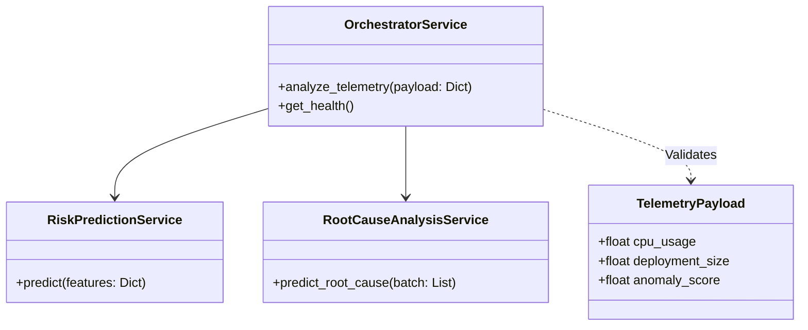

# Class Diagram

```mermaid
classDiagram
    class OrchestratorService {
        +analyze_telemetry(payload: Dict)
        +get_health()
    }
    class RiskPredictionService {
        +predict(features: Dict)
    }
    class RootCauseAnalysisService {
        +predict_root_cause(batch: List)
    }
    class TelemetryPayload {
        +float cpu_usage
        +float deployment_size
        +float anomaly_score
    }
    OrchestratorService --> RiskPredictionService
    OrchestratorService --> RootCauseAnalysisService
    OrchestratorService ..> TelemetryPayload : Validates
```
