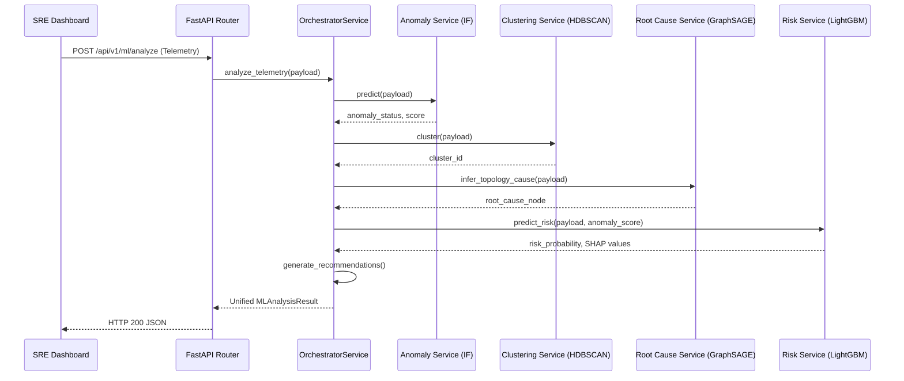

# Sequence Diagram: ML Orchestration

```mermaid
sequenceDiagram
    participant User as SRE Dashboard
    participant API as FastAPI Router
    participant Orch as OrchestratorService
    participant IF as Anomaly Service (IF)
    participant HDB as Clustering Service (HDBSCAN)
    participant GS as Root Cause Service (GraphSAGE)
    participant LGB as Risk Service (LightGBM)

    User->>API: POST /api/v1/ml/analyze (Telemetry)
    API->>Orch: analyze_telemetry(payload)
    
    Orch->>IF: predict(payload)
    IF-->>Orch: anomaly_status, score
    
    Orch->>HDB: cluster(payload)
    HDB-->>Orch: cluster_id
    
    Orch->>GS: infer_topology_cause(payload)
    GS-->>Orch: root_cause_node
    
    Orch->>LGB: predict_risk(payload, anomaly_score)
    LGB-->>Orch: risk_probability, SHAP values
    
    Orch->>Orch: generate_recommendations()
    Orch-->>API: Unified MLAnalysisResult
    API-->>User: HTTP 200 JSON
```
